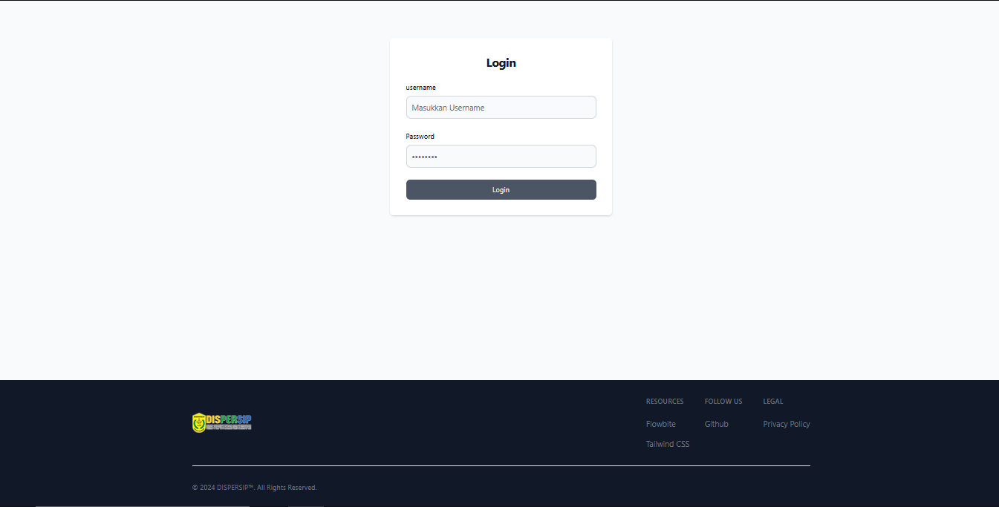
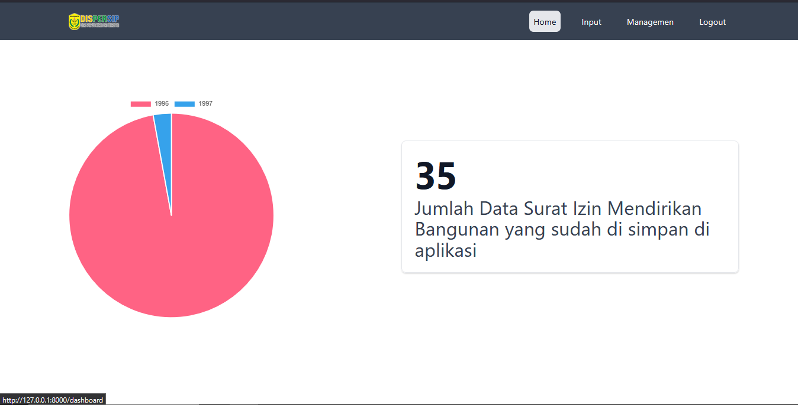
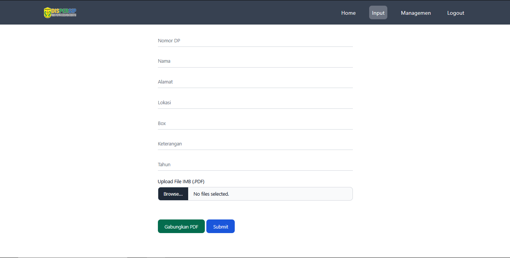
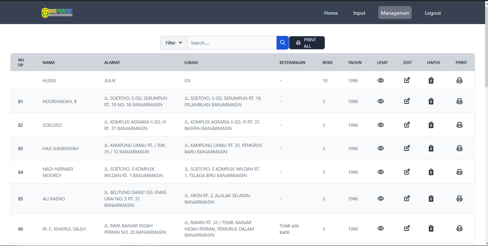

#  ARSIP - IMB Digital Archive System

  
  
  
  

A web-based application designed for the digital archiving and management of IMB (Izin Mendirikan Bangunan - Building Permit) documents. Developed for government agencies or departments, this system aims to modernize record-keeping by centralizing archives, enabling quick and powerful searches, and providing integrated tools for PDF document management.

##  Screenshots

| Login Page | Dashboard |
| :---: | :---: |
| Secure access for authorized personnel. | At-a-glance view of archive statistics. |
| **** | **** |

| Data Input & PDF Tools | Data Management |
| :---: | :---: |
| Form for inputting new archive data with PDF upload and merge capabilities. | Searchable and filterable data table with CRUD and print actions. |
| **** | **** |

## ✨ Key Features

-    **Secure Authentication,** A dedicated login system to ensure data security and integrity.
-    **Interactive Dashboard,** A visual dashboard presenting key statistics, including a chart summarizing archives by year.
-    **Comprehensive Archive Management:**
     -   Full CRUD (Create, Read, Update, Delete) functionality for IMB records.
     -   Attach original scanned documents in PDF format to each record.
     -   **Directly view or download the original uploaded PDF file** for easy access and verification.
-    **Powerful Search & Reporting:**
     -   An intuitive search bar and filtering system to quickly locate specific archives.
     -   **Generate and export the filtered data list as a new PDF document.**
     -   **Print the filtered report list** directly from the browser.
-    **Advanced PDF Tools:**
     -   A unique feature to **merge multiple individual PDF files** into a single

##  Tech Stack

-   **Backend**: Laravel 11, PHP 8.2+
-   **Frontend**: Tailwind CSS, Flowbite, Blade
-   **Database**: MySQL 
-   **Key Libraries**:
    -   `webklex/laravel-pdfmerger`: For merging PDF documents.
-   **Asset Bundling**: Vite
-   **Development Tools**: Composer, NPM